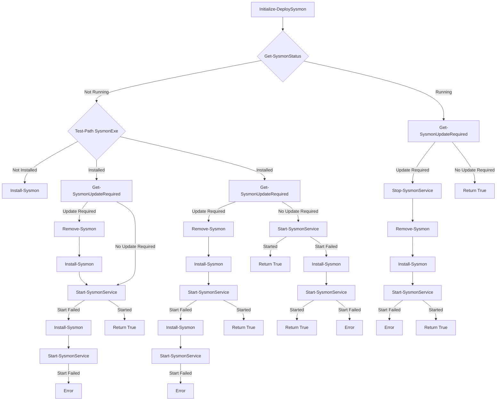

# SysmonDeployStartupScript
A PowerShell script designed to deploy Sysmon via Active Directory Group Policy(GPO) start-up script.

### Deployment Methods
1. **GPO Startup Script**: [This script is designed to be deployed via GPO startup script.](https://cybergladius.com/sysmon-deployment-via-active-directory-gpo/)
2. **Immediate Scheduled Task GPO**: [The script can be quickly deployed on systems via an immidiate scheduled task GPO.](https://cybergladius.com/fast-ad-gpo-software-deployment-method/)
3. **Manual Deployment**: The script can be run manually on a system to deploy Sysmon.

## Features Highlights

 - Self Updating
 - Creates Event logs everytime is runs to make trubleshooting easier.
 - No network file share needed
 - No managing Sysmon MSI/EXE files.
 - Sysmon is configured with SwiftOnSecurity's customer Sysmon Config
 - Can be run manually
#
### Self Updating
The script will make an HTTPS query to the Microsoft Sysmon web page to get the latest Sysmon version number. If that version number is greater than the currently installed version, remove the current Sysmon versions, download the latest version, and install it. 

This approach in a GPO startup script has pros and cons.
#### Pros
 - No internal file share for hosting MSI/EXE files.
 - Systems will always run the latest version of Sysmon.
#### Cons
 - The endpoint has to have internet access on bootup.
 - The start up time is extended; every boot up has to make a web request to get the current version number.

*Note: Sysmon and the config are installed into "C:\Windows\\"*

### Sysmon Config
SwiftOnSecurity has one of the most popular configuration files for  Sysmon. So, this script pulls that config file from GitHub and applies it to the system.
URL: https://github.com/SwiftOnSecurity/sysmon-config

### Design Philosophy
My design philosophy in this script is to minimize unexpected outcomes. To this end, I try to make every function return a boolean: True, it worked; false, it failed. True is returned if the script finishes without error; otherwise, if something is wrong, return Falue. 

## Script Run Flow

